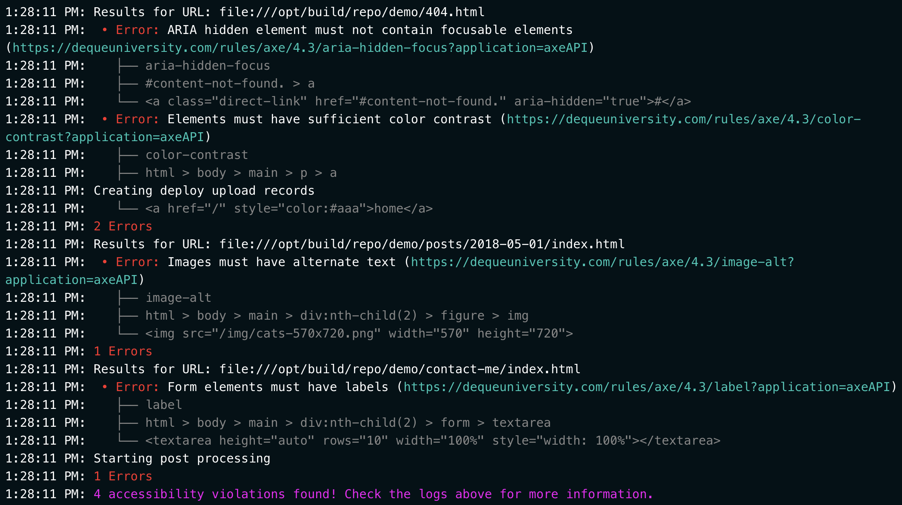

# netlify-plugin-a11y

Check for accessibility issues on critical pages of your Netlify website.

🚧 **Note:** This plugin is pre-release software. Until version 1.0.0 is released, its API could change at any time. If you experience unexpected behavior while using this plugin, check [the changelog](./CHANGELOG.md) for any changes you might have missed, and please feel free to report an issue or submit a pull request about any issues you encounter.

## What does this plugin do?
This plugin uses [`pa11y`](https://github.com/pa11y/pa11y) (which in turn uses [`axe-core`](https://github.com/dequelabs/axe-core)) to check your Netlify project for accessibility issues. 

If issues are found, the plugin generates a report which provides:
- the path to the HTML file in which the error was found
- a description of the error with a link to the relevant [Deque University rule](https://dequeuniversity.com/rules/axe/latest)
- the name of the error within the aXe API
- the path to the the DOM element associated with the error
- the DOM element itself
- the total number of issues on the page
- the sum of *all* issues across *all* pages that were checked

By default, the plugin checks **all** your site's pages for violations of WCAG 2.1 level AA, and fails the site build if any a11y issues are found.
## Demo

The demo site is an Eleventy blog containing some pages that have accessibility issues: https://netlify-plugin-a11y-demo.netlify.com/

- the "go home" link on [the 404 page](https://netlify-plugin-a11y-demo.netlify.app/404.html) has insufficient color contrast.
- the cat photo on [the blog post](https://netlify-plugin-a11y-demo.netlify.app/404.html) doesn't have an `alt` attribute.
- the textarea on [the contact page](https://netlify-plugin-a11y-demo.netlify.app/contact-me/) is missing a proper label

With these errors, the logs for the demo look like this:


<details>
	<summary>Text from screnshot of demo site build log</summary>

```
9:49:36 PM: Results for URL: file:///opt/build/repo/demo/404.html
9:49:36 PM:  • Error: ARIA hidden element must not contain focusable elements (https://dequeuniversity.com/rules/axe/4.3/aria-hidden-focus?application=axeAPI)
9:49:36 PM:    ├── aria-hidden-focus
9:49:36 PM:    ├── #content-not-found. > a
9:49:36 PM:    └── <a class="direct-link" href="#content-not-found." aria-hidden="true">#</a>
9:49:36 PM:  • Error: Elements must have sufficient color contrast (https://dequeuniversity.com/rules/axe/4.3/color-contrast?application=axeAPI)
9:49:36 PM:    ├── color-contrast
9:49:36 PM:    ├── html > body > main > p > a
9:49:36 PM:    └── <a href="/" style="color:#aaa">home</a>
9:49:36 PM: 2 Errors
9:49:36 PM: Results for URL: file:///opt/build/repo/demo/posts/2018-05-01/index.html
9:49:36 PM:  • Error: Images must have alternate text (https://dequeuniversity.com/rules/axe/4.3/image-alt?application=axeAPI)
9:49:36 PM:    ├── image-alt
9:49:36 PM:    ├── html > body > main > div:nth-child(2) > figure > img
9:49:36 PM:    └── 
9:49:36 PM: Creating deploy upload records
9:49:36 PM: 1 Errors
9:49:36 PM: Results for URL: file:///opt/build/repo/demo/contact-me/index.html
9:49:36 PM:  • Error: Form elements must have labels (https://dequeuniversity.com/rules/axe/4.3/label?application=axeAPI)
9:49:36 PM:    ├── label
9:49:36 PM:    ├── html > body > main > div:nth-child(2) > form > textarea
9:49:36 PM:    └── <textarea height="auto" rows="10" width="100%" style="width: 100%"></textarea>
9:49:36 PM: 1 Errors
9:49:36 PM: 4 accessibility issues found! Check the logs for more information.
```
</details>


## Installation via the Netlify UI
To install the plugin in the Netlify UI, use this [direct in-app installation link](https://app.netlify.com/plugins/netlify-plugin-a11y/install) or go to the [plugins directory](https://app.netlify.com/plugins).

When installed this way, the plugin follows its default behavior, which is to check **all** your site's pages for violations of WCAG 2.1 level AA, and fail the site build if any a11y issues are found.

To change the plugin's behavior, you'll want to install it throigh your `netlify.toml` file.

## Installation via the `netlify.toml` file
First, install the plugin as a dev dependency. If you're using NPM to manage your packages, run the following:
``` bash
npm install --save-dev @netlify/plugin-a11y
```

If you're using Yarn, run the following:
``` bash
yarn add --dev @netlify/plugin-a11y
```

Next, add `@netlify/plugin-a11y` to the plugins section of your `netlify.toml` file.

```toml
[[plugins]]
  package = "@netlify/plugin-a11y"
```
⚠️ In `.toml` files, whitespace is important! Make sure `package` is indented two spaces.

If you want to use the plugin's default settings (check **all** pages of your site for violations of WCAG 2.1 level AA; fail the netlify build if issues are found), this is all you need to do. If you want to change the way the plugin behaves, read on to the next section.

## Configuration
If you've installed the plugin via `netlify.toml`, you can add a `[[plugins.inputs]]` field to change how the plugin behaves. This table outlines the inputs the plugin accepts. All of them are optional.


| Input name          | Description                                                                                          | Value type            | Possible values                               | Default value |
| ------------------- | ---------------------------------------------------------------------------------------------------- | --------------------- | --------------------------------------------- | ------------- |
| `checkPaths`        | Indicates which pages of your site to check                                                          | Array of strings      | Any directories or HTML files in your project | `['/']`       |
| `failWithIssues`    | Whether the build should fail if a11y issues are found                                               | Boolean               | `true` or `false`                             | `true`        |
| `ignoreDirectories` | Directories that *should not* be checked for a11y issues                                             | Array of strings      | Any directories in your project               | `[]`          |
| `ignoreElements`    | Indicates elements that should be ignored by a11y testing                                            | String (CSS selector) | Comma-separated string of CSS selectors       | `undefined`   |
| `ignoreGuidelines`  | Indicates guidelines and types to ignore ([pa11y docs](https://github.com/pa11y/pa11y#ignore-array)) | Array of strings      | Comma-separated string of WCAG Guidlines      | `[]`          |
| `wcagLevel`         | The WCAG standard level against which pages are checked                                              | String                | `'WCAG2A'` or `'WCAGA2A'` or `'WCAG2AAA'`     | `'WCAG2AA'`   |

Here's how these inputs can be used in `netlify.toml`, with comments to explain how each input affects the plugin's behavior:

``` toml
[[plugins]]
  package = "@netlify/plugin-a11y"
  [plugins.inputs]
    # Check all HTML files in this project (the default behavior)
    checkPaths = ['/']
    # Do not fail the build if a11y issues are found
    failWithIssues = false
    # Ignore all HTML files in `/admin`
    ignoreDirectories = ['/admin']
    # Ignore any accessibility issues associated with an element matching this selector
    ignoreElements = '.jumbotron > h2'
    # Ignore any accessibility issues associated with this rule code or type
    ignoreGuidelines = ['WCAG2AA.Principle1.Guideline1_4.1_4_6.G17']
    # Perform a11y check against WCAG 2.1 AAA
    wcagLevel = 'WCAG2AAA'
```
